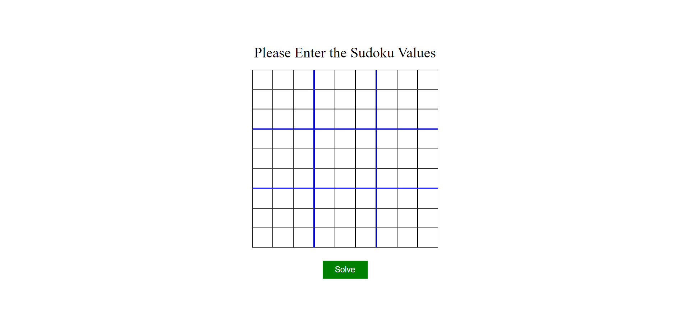

# sudoku-solver
This is my beginner project using frontend technologies HTML, CSS and JavaScript.
I used VSCode as IDE. I used live-server as server in VSCode. You can check the official documentation [ https://github.com/ritwickdey/vscode-live-server ] to know how to install ans use live server.

## How to use
### After installing VScode and live server follow the below steps.
  ### 1. Right click in 'index.html' page.
  ### 2. Click on Open with Live server. It redirects you to the default browser displaying index.html page (Landing Page) 
  ### 3. Here you can fill sudoku values in the box. Fill valid inputs ( i.e. 1 - 9 ). If any value otherthan values[ 1 to 9] is filled, the browser shows a pop-up showing "Please enter a valid digit in range 1 to 9 ( both inclusive )".You have to enter valid digits only.  If no value is present in a box just leave it.
  ### 4. Click on 'Solve' button to solve after entering sudoku values
  ### 5. If entered sudoku is solvable then it displays the solution to the sudoku
  ### 6. Else it shows a pop-up showing "The Entered Sudoku cannot be solved. Please enter another sudoku". This may occur if entered sudoku values may be not a valid sudoku. ( i.e. In any of the row, column or square box, there may be a digit whiich is occuring twice. )
